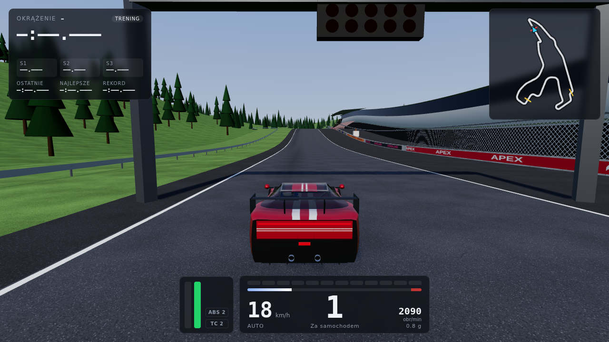
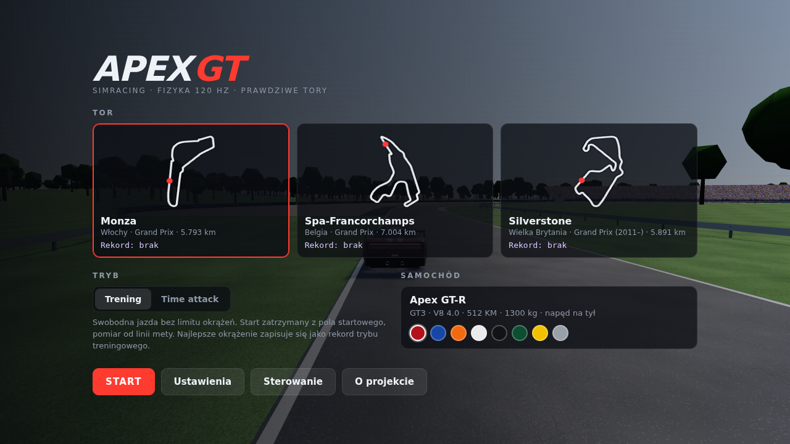
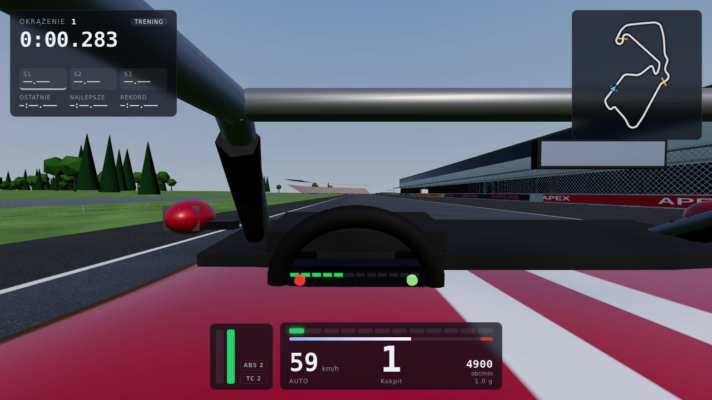
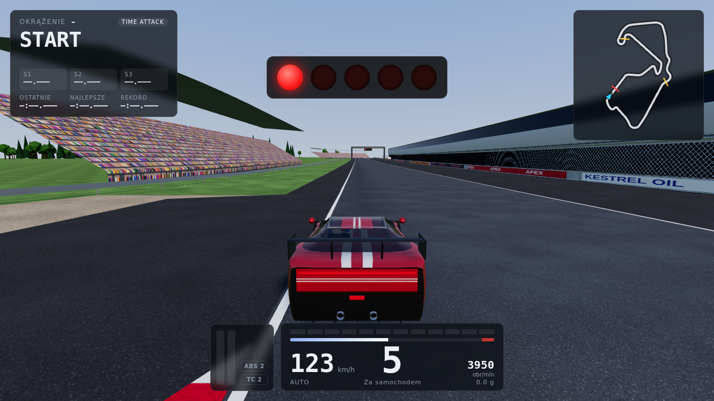

# Apex GT – przeglądarkowa gra simracingowa 3D

Samochód klasy GT3 (fikcyjny „Apex GT-R”, V8 z przodu, napęd na tył) na trzech rzeczywistych torach
w wariancie Grand Prix: **Monza**, **Spa-Francorchamps** i **Silverstone**. Całość działa w przeglądarce
(Three.js + własny silnik fizyki). Ruch auta wynika wyłącznie z sił i momentów liczonych ze stałym
krokiem **120 Hz**, niezależnie od liczby klatek.



| Menu | Kokpit (Silverstone) | Time attack – światła startowe |
|---|---|---|
|  |  |  |

> Zrzuty pochodzą z automatycznego testu w Chromium z renderowaniem **programowym** (SwiftShader, bez GPU).
> Gra nie ma postprocessingu, więc na karcie graficznej obraz powinien wyglądać tak samo. Płynności na GPU
> nie mierzono (patrz sekcja „Weryfikacja”).

---

## Uruchomienie

Wymagany Node.js 18 lub nowszy.

```bash
npm install
npm run dev          # serwer deweloperski -> http://localhost:5173
```

Inne warianty:

```bash
npm run build && npm run preview   # wersja produkcyjna (dist/) -> http://localhost:4173
npm run build:single               # jeden plik dist-single/index.html (~1 MB),
                                   # można go otworzyć bezpośrednio z dysku, bez serwera
npm test                           # testy fizyki (Node, bez przeglądarki), wyniki w tests/RESULTS.md
npm run test:browser               # test w przeglądarce (Playwright + Chromium), zrzuty w docs/screenshots
npm run build:tracks               # ponowne wygenerowanie danych torów z surowych źródeł (wymaga sieci)
```

Dźwięk startuje po pierwszym kliknięciu (polityka autoodtwarzania przeglądarek).

## Sterowanie

| Akcja | Klawiatura | Pad (Xbox / PlayStation) |
|---|---|---|
| Gaz / hamulec | `↑` / `↓` lub `W` / `S` | RT / LT (R2 / L2), analogowo |
| Skręt | `←` `→` lub `A` `D` | lewa gałka, analogowo |
| Bieg w górę / w dół | `E` / `Q` (albo `Shift` / `Ctrl`) | RB / LB (albo A / X) |
| Hamulec ręczny | `Spacja` | B (○) |
| Kamera: za autem / maska / kokpit | `C` | Y (△) |
| Widok do tyłu | `B` (przytrzymaj) | krzyżak w dół |
| Ustaw auto na torze (po wypadku) | `R` | View / Share |
| Pauza | `Esc` / `P` | Menu / Options (w menu głównym: start sesji) |

Przy automatycznej skrzyni bieg wsteczny włącza się po przytrzymaniu hamulca w miejscu przez ok. 0,8 s.
Przy ręcznej skrzyni redukujesz bieg z 1 przez N do R.

Na klawiaturze skręt narasta płynnie. Jego maksymalny zakres zależy od prędkości i jest liczony fizycznie:
to kąt potrzebny do osiągnięcia ok. 1,75 g plus niewielki zapas (np. 6,7° kół przy 100 km/h,
3,9° przy 200 km/h). Opcjonalne „wspomaganie kontry” przesuwa środek zakresu w stronę kontry,
gdy tył zaczyna się ślizgać. Czułość i redukcję skrętu z prędkością ustawisz w menu.

## Tryby gry

- **Trening**: start z pola startowego za linią (5 świateł, zgaśnięcie = start), dowolna liczba
  okrążeń, pomiar od pierwszego przecięcia linii mety.
- **Time attack**: start lotny przed ostatnim zakrętem (auto zamrożone z prędkością do zgaśnięcia
  świateł). Na żywo widać deltę do rekordu, a najlepsze ważne okrążenie zapisuje się jako rekord.
- W obu trybach: 3 sektory w kolorach jak w F1 (fiolet = najlepszy w sesji, żółty = wolniejszy),
  punkty kontrolne co ~150 m, **unieważnienie okrążenia** po wyjechaniu wszystkimi czterema kołami
  poza tor (krawężnik liczy się jako tor), po pominięciu punktu kontrolnego, przejechaniu linii pod prąd
  albo resecie auta. Rekordy (czas, sektory, ślad czasu do delty) trafiają do `localStorage`.
- Pauza z listą okrążeń sesji, restart sesji, reset auta na torze, powrót do menu.
- W tle menu jeździ samochód sterowany autopilotem przez te same wejścia co gracz.

## Co zostało zaimplementowane

**Fizyka** (`src/physics/`, wszystkie parametry auta w jednym pliku `src/config/carConfig.js`)
- Bryła sztywna 6DOF: masa 1300 kg, tensor bezwładności (pochylenie/odchylenie/przechył),
  środek ciężkości na 0,46 m. Przenoszenie obciążeń przy hamowaniu, przyspieszaniu i skręcaniu
  wynika z równowagi sił w zawieszeniu, nie jest dopisywane sztucznie (test: 94% wartości teoretycznej m·a·h/L).
- 4 niezależne koła: promień zawieszenia wzdłuż osi nadwozia, sprężyny, dwustopniowe tłumiki
  (osobno dobicie i odbicie), progresywne odboje, stabilizatory, kontakt z nawierzchnią (normalna, wysokość, typ).
- Opona: łączony poślizg z krzywą Pacejki („magic formula”), znormalizowany do poślizgu szczytowego.
  Hamowanie i skręt dzielą **wspólny limit przyczepności**, μ maleje z obciążeniem, a za szczytem siła
  spada do ~76%. Stany poślizgu mają długość relaksacji (stabilność przy małych prędkościach).
  Podsterowność, nadsterowność, blokowanie kół i utrata tyłu przy gazie wynikają z modelu.
- Silnik: krzywa momentu (512 KM / 565 Nm), bezwładność, hamowanie silnikiem, ogranicznik obrotów,
  wolne obroty. Do tego automatyczne sprzęgło z ograniczonym momentem, 6-biegowa sekwencyjna skrzynia
  (czas zmiany, przerwa w napędzie, międzygaz przy redukcji, ochrona przed przekręceniem),
  mechanizm różnicowy LSD (preload + rampy).
- Aerodynamika: opór Cd·A, docisk Cl·A osobno na osi przedniej i tylnej.
- ABS (4 poziomy + wył.): moment hamowania ograniczony do wartości, przy której opona pracuje na
  zadanym poślizgu (liczonej z modelu opony), oś tylna „select-low”, ograniczona różnica lewo/prawo na przodzie.
- TC (4 poziomy + wył.): poślizg wzdłużny kół napędzanych i łączny poślizg opony (ogranicza obrót przy gazie w zakręcie).
- Nawierzchnie: asfalt, krawężnik (wyższy, żebrowany), asfaltowe pobocze, trawa, żwir. Różnią się
  przyczepnością, oporem toczenia (żwir „wciąga”), nierównościami i zapadaniem.
- Kolizje: punkty nadwozia z barierami i podłożem (impulsy z tarciem i restytucją, korekcja pozycji).
- Stały krok 120 Hz z 4 podkrokami dynamiki kół i opon (480 Hz) oraz interpolacja stanu przy renderowaniu.

**Tory** (`src/tracks/`, `tools/build-tracks.mjs`)
- Linia środkowa i szerokość toru co 5 m z bazy TUMFTM (OSM + zdjęcia satelitarne). Georeferencja
  przez dopasowanie ICP do współrzędnych geograficznych z `bacinger/f1-circuits`
  (RMS: Monza 1,1 m, Spa 1,3 m, Silverstone 1,6 m).
- Długości: Monza 5791 m, Spa 7001 m, Silverstone 5887 m (oficjalnie 5793 / 7004 / 5891 m).
- Wysokości z DEM (AWS Terrain Tiles). Przewyższenia po wygładzeniu: Spa 104,7 m, Monza 16,4 m,
  Silverstone 12,2 m. Teren wokół toru (0,7–0,9 km) to również rzeczywisty DEM.
- Kolejność i kierunek zakrętów sprawdzone z rzeczywistością, np. Monza: Rettifilo, Curva Grande,
  Roggia, Lesmo 1–2, Ascari, Parabolica.
- Asfalt z zagumowaną linią jazdy, białe linie krawędzi, krawężniki z kolizją i wibracją, pobocza,
  strefy żwirowe i asfaltowe, bariery (armco, beton z siatką i reklamami, ściany opon) z kolizją,
  linia start/meta, pola startowe, brama świateł startowych, 3 sektory, punkty kontrolne, poprawne miejsce startu.
- Minimapa rysowana z tej samej geometrii co fizyka.

**Grafika** (`src/render/`): gradientowe niebo z tarczą słońca i mapą odbić, cienie słońca
podążające za autem, lakier z clearcoatem, proceduralne tekstury (asfalt, trawa z pasami koszenia,
żwir, krawężniki, beton, siatka, opony, widzowie). Do tego teren z DEM, las z instancjonowanych drzew
z 2 poziomami szczegółowości (Monza: park liściasty, Spa: Ardeny iglaste, Silverstone: rzadkie zadrzewienia),
trybuny, budynek boksów, posterunki porządkowe, ślady opon, dym i pył spod kół. Model auta jest
proceduralny: loftowana karoseria, nadkola, splitter, dyfuzor, skrzydło, lusterka, numer startowy,
reflektory, tylna listwa LED i światła stop, obracające się i skręcające koła (rozmycie szprych przy
dużej prędkości), tarcze rozgrzewające się przy hamowaniu. Kokpit ma deskę, kierownicę GT3 z wyświetlaczem
(bieg, obroty, delta), klatkę i lusterko. Kamery: za autem (z opóźnieniem kąta, widać poślizg), z maski
i z kokpitu (ruch głowy od przeciążeń, patrzenie w zakręt).

**Dźwięk** (`src/audio/`, synteza Web Audio, bez plików): silnik V8 z bufora impulsów wydechowych
(nierówne amplitudy cylindrów), z wysokością zależną od obrotów i barwą zależną od obciążenia
(przenikanie warstw, filtr, przester), inny w kokpicie i na zewnątrz. Do tego dolot, wycie przekładni,
pisk opon zależny od poślizgu, dudnienie krawężników z częstotliwością żebrowania, żwir, trawa, wiatr,
dźwięk zmiany biegu, strzały z wydechu przy odpuszczeniu gazu, uderzenia oraz sygnały startowe i okrążeń.

**HUD**: prędkość (km/h lub mph), bieg, obroty z diodami zmiany biegu, pedały, ABS/TC, czas okrążenia,
delta, sektory, ostatnie, najlepsze w sesji i rekordowe okrążenie, minimapa, licznik FPS (opcjonalnie).

**Ustawienia** (wszystkie działają i są zapisywane): jakość grafiki (niska/średnia/wysoka/ultra),
skala rozdzielczości, FOV kamer, domyślna kamera, dym, linia wyścigowa (pomoc), FPS, ABS, TC, skrzynia,
jednostki, kolor auta, czułość skrętu, redukcja skrętu z prędkością, wspomaganie kontry, martwa strefa
i krzywa pada, obracana minimapa oraz głośności (ogólna, silnik, efekty).

## Weryfikacja – faktycznie wykonane testy i zmierzone wyniki

### Testy fizyki (`npm test`, pełny raport: [tests/RESULTS.md](tests/RESULTS.md))

Wszystkie testy przechodzą. Najważniejsze zmierzone wartości:

| Test | Wynik |
|---|---|
| Rozkład obciążeń w spoczynku | 2999 N przód / 3377 N tył na koło (teoria: 2999 / 3377 N), dryf 0 m |
| 0–100 / 0–200 km/h (TC 2) | 3,60 s / 9,78 s; prędkość maks. 284 km/h na 6. biegu |
| Hamowanie 100–0 km/h | ABS 2: 24,9 m (śr. 1,57 g); bez ABS: 28,2 m, przód zablokowany przez 87% czasu |
| Hamowanie 200–0 km/h | ABS 2: 84,4 m (śr. 1,72 g, z dociskiem); bez ABS: 97,1 m |
| Hamowanie 220→60 km/h, lewe koła na krawężniku | z ABS: maks. kąt znoszenia 0,8°; bez ABS (wszystkie koła zablokowane) auto obraca się o 45° |
| Przenoszenie obciążenia przy hamowaniu 1,3 g | 0,94 × wartość teoretyczna m·a·h/L |
| Jazda po okręgu R = 50 m | maks. 1,44 g; gradient podsterowności 1,4°/g, na granicy uślizg przodu (β = 1,4°) |
| Pełny gaz w zakręcie na 2. biegu | bez TC: obrót (β 90°); z TC 2: β maks. 4,2° |
| Pełny skręt przy 120 km/h | promień 75,6 m przy geometrycznym 7,0 m (podsterowność, poślizg przodu 3,0× szczyt) |
| Wybieg ze 150 km/h | asfalt 0,18 g, trawa +0,06 g, żwir 0,62 g; maks. ay: asfalt 1,37 g, trawa 0,81 g, żwir 0,47 g |
| Niezależność od FPS | identyczny wynik dla 30/60/144/240 i losowych 20–160 FPS (różnica 0,000 m przy wejściu co krok fizyki; 0,03 m przy wejściu co klatkę, czyli kwantyzacja wejść) |
| Zbieżność kroku | 120 Hz vs 240 Hz: 0,10 m różnicy po 12 s jazdy |
| Kolizja z barierą przy 220 km/h | auto zatrzymane, środek auta nigdy za linią bariery (min. 2,5 m zapasu), brak NaN |
| Pełne okrążenia (autopilot przez wejścia gracza, ABS 2 / TC 2) | Monza 2:07,9, Spa 2:48,3, Silverstone 2:35,8; okrążenia ważne, 0 uderzeń |
| Pełne okrążenia **tylko klawiaturą** (wejścia 0/1 przez ten sam filtr co u gracza) | Monza 2:18,5, Spa 3:03,6, Silverstone 2:46,1; ważne, 0 uderzeń |

Czasy autopilota są celowo zachowawcze (prowadzi go uproszczony profil prędkości z zapasem) i nie
pokazują osiągów auta. Dla porównania prawdziwe GT3 jeżdżą ok. 1:46 (Monza), 2:17 (Spa), 1:58 (Silverstone).

### Test w przeglądarce (`npm run test:browser`)

Wykonany w Chromium headless z **programowym** WebGL (SwiftShader), bo środowisko nie ma GPU:
- menu → start → jazda na każdym torze, przełączanie 3 kamer, pauza i wznowienie, reset auta,
  powrót do menu, zmiana toru, ustawienia, ekran sterowania: **bez błędów w konsoli**;
- pomiar czasu w UI (time attack): okrążenie się rozpoczyna, a po pominięciu punktów kontrolnych
  zostaje unieważnione z komunikatem; wersja jednoplikowa działa z `file://`;
- złożoność sceny przy jakości „średniej”: Monza 345 wywołań rysowania i 346 tys. trójkątów,
  Spa 228 i 104 tys., Silverstone 355 i 256 tys.

**Nie zmierzono FPS na rzeczywistym sprzęcie z kartą graficzną.** W SwiftShader gra osiąga ok. 1–2 FPS
przy 1280×720, co mówi tylko o wydajności renderowania programowego na CPU. Liczba wywołań rysowania
i trójkątów jest w zasięgu typowej karty średniej klasy przy 1080p/60 FPS, ale to szacunek, nie pomiar.
Jeśli FPS będzie za niski, w ustawieniach można obniżyć jakość (mniejsza mapa cieni lub brak cieni,
mniej drzew, krótszy zasięg widzenia) albo skalę rozdzielczości.

## Optymalizacje wydajności

- Presety jakości: rozmiar mapy cieni (brak / 1024 / 2048 / 4096), cień tylko w obszarze ~85 m wokół auta
  (z przyciąganiem do siatki tekseli), liczba drzew (2,5–18 tys.), zasięg widzenia, rozdzielczość siatki terenu.
- Drzewa jako `InstancedMesh` w fragmentach 300 m z dwoma poziomami szczegółowości (LOD) i ukrywaniem
  dalekich fragmentów. Słupki barier i posterunki też są instancjonowane, a materiały i tekstury współdzielone.
- Tor podzielony na fragmenty ~320 m (frustum culling i ukrywanie dalekich części).
- Szybka mapa najbliższych punktów toru (transformata odległości) do budowy terenu i lasu: ~55 ms na 100 tys. zapytań.
- HUD aktualizuje DOM tylko przy zmianie wartości, minimapa odświeża się z częstotliwością 30 Hz.

## Uproszczenia (uczciwie)

**Fizyka**
- Brak temperatury i zużycia opon, ciśnień, kąta pochylenia (camber) i wpływu geometrii zawieszenia.
  Centrum przechyłu leży na ziemi, a siły opon działają w punkcie styku.
- Masa nieresorowana nie jest symulowana osobno, a kontakt koła z nawierzchnią to pojedynczy promień
  (bez profilu opony przy uderzeniu w krawędź).
- Docisk nie zależy od prześwitu ani pochylenia, brak efektu cienia aerodynamicznego, wiatru i deszczu.
- Silnik nie gaśnie, sprzęgło jest zawsze automatyczne. Brak uszkodzeń, a kolizje to impulsy na kilkunastu
  punktach prostopadłościanu nadwozia.
- Samochód jest fikcyjny. Parametry są typowe dla GT3, ale nie odwzorowują konkretnego modelu.

**Tory**
- **Przebieg, szerokość i wysokości pochodzą z danych rzeczywistych, ale z ograniczoną dokładnością.**
  Szerokości TUM są wykrywane automatycznie (przyjęto minimum 9,2 m), a linia środkowa jest wygładzona.
  DEM ma rozdzielczość ~30 m i jest modelem powierzchni (w Monzie usuwano wpływ koron drzew, profile
  wygładzono), więc lokalne nachylenia są przybliżone.
- Silverstone: dane źródłowe startują na dawnej linii mety (National Pit Straight). Linię startu i mety
  przeniesiono na Hamilton Straight (układ od 2011 r.) ok. 280 m przed Abbey. To położenie jest przybliżone.
- **Krawężniki, strefy wyjazdowe (trawa/żwir/asfalt), bariery i ich odległość od toru są generowane
  proceduralnie według krzywizny i prędkości dojazdu.** Odpowiadają typowemu układowi, a nie dokładnej kopii.
- Trybuny, budynek boksów, reklamy (fikcyjne marki) i posterunki stoją w miejscach przybliżonych.
  Nie ma alei serwisowej jako drogi ani starego owalu w Monzie. Sektory są podzielone w przybliżeniu
  na trzy części na prostych odcinkach i nie pokrywają się z oficjalnymi.

## Struktura projektu

```
src/config/carConfig.js   – WSZYSTKIE parametry samochodu i stałe symulacji
src/physics/              – Vehicle (bryła + koła + zawieszenie + kolizje), tyre, drivetrain, surfaces
src/tracks/               – Track (geometria, zapytania nawierzchni, bariery, sektory), trackList, data/*.json
src/game/                 – Game (pętla, sesje), LapTimer, FixedStepper, Input, autopilot, Storage
src/render/               – TrackMesh, Environment (niebo, teren, las), CarModel, CameraRig, Effects, textures
src/audio/AudioEngine.js  – synteza dźwięku
src/ui/                   – HUD, Minimap, menu i ustawienia, style
tools/build-tracks.mjs    – generator danych torów (TUM + GeoJSON + DEM -> JSON)
tests/                    – testy fizyki (Node) i test przeglądarkowy (Playwright)
```

## Źródła danych i licencje

- TUMFTM racetrack-database: linie środkowe, szerokości i linie wyścigowe,
  [LGPL-3.0](https://github.com/TUMFTM/racetrack-database). Dane pochodzą z OpenStreetMap (© współtwórcy OSM).
- bacinger/f1-circuits: GeoJSON torów F1, [MIT](https://github.com/bacinger/f1-circuits).
- Mapzen/AWS Terrain Tiles: wysokości (SRTM, EU-DEM i inne,
  [atrybucje](https://github.com/tilezen/joerd/blob/master/docs/attribution.md)).
- Three.js (MIT). Wszystkie tekstury, model auta i dźwięki są generowane w kodzie.
